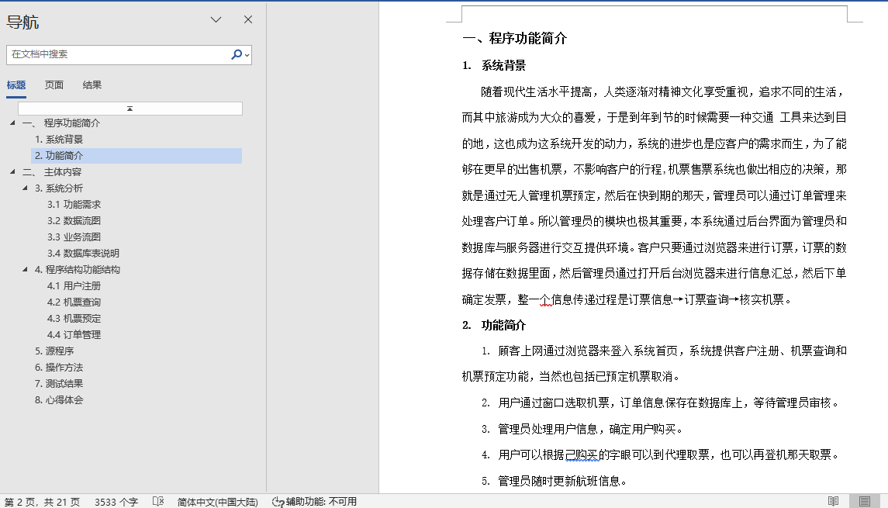
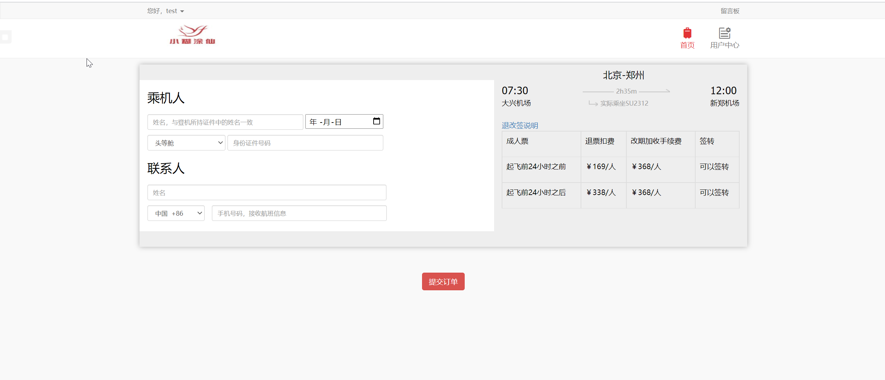
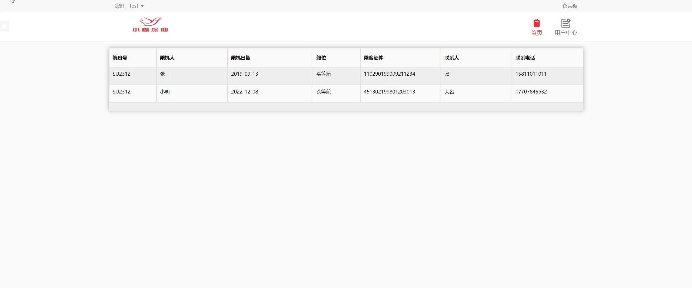
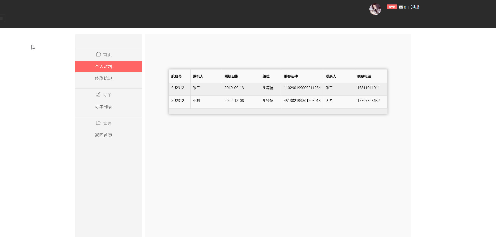
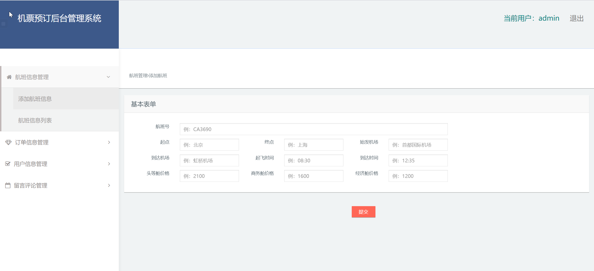
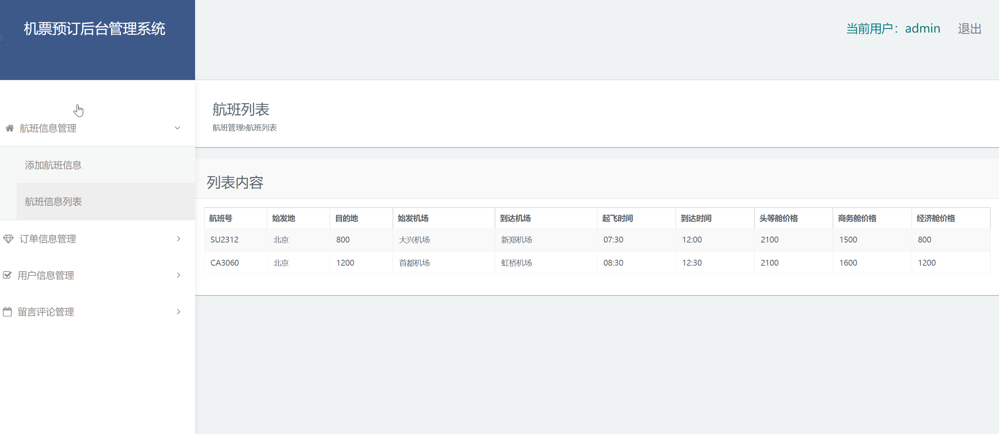
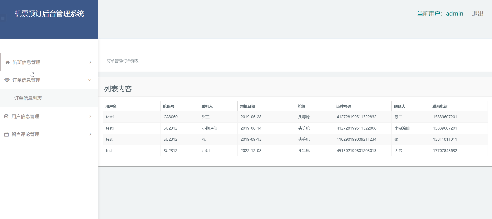
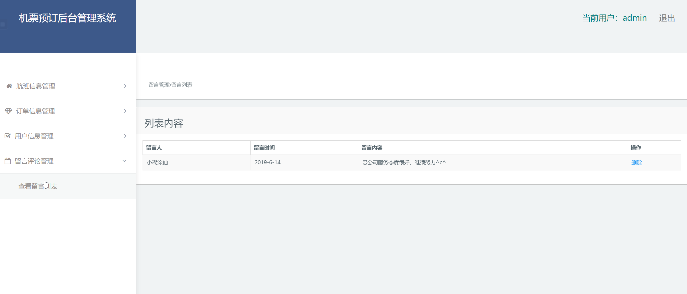

## 基于JSP+Servlet实现的机票预订系统(程序+课程报告)

###  获取sql数据库文件: 从戎源码网 (https://armycodes.com/) QQ: 386869957 QQ群: 377586148
###  所有系统地址: (https://github.com/YuLin-Coder/AllProjectCatalog) 
###  所有项目以及源代码本人均调试运行无问题 可支持远程安装部署调试、定制修改、代码讲解

## 项目介绍
基于JSP+Servlet实现的机票预订系统，主要功能如下

【用户】
选择单程或者其他；
出发城市-到达城市选择
机票预定，
填写乘机信息，

用户个人资料修改，查看订单列表

【管理员】
航班信息管理：添加航班信息，航班信息列表
订单信息管理：订单信息列表
留言评论管理：查看留言列表
用户信息管理：

## 项目技术
- 编程语言：Java
- 数据库：MySQL
- 前端技术：JSP、JavaScript、bootstrap、JQuery
- 后端技术：Servlet、JDBC

## 运行环境
- JDK版本：JDK1.8及以上
- 开发工具：IDEA、Ecplise、Myecplise都可以
- 数据库: MySQL5.7及以上

## 运行截图

